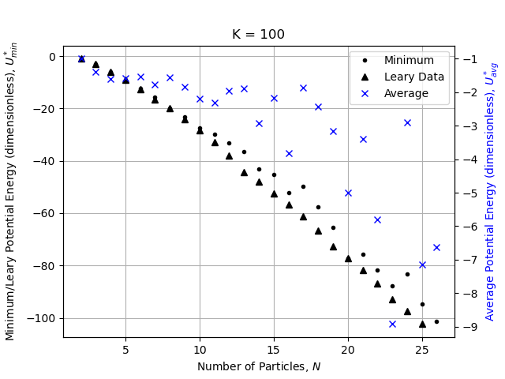
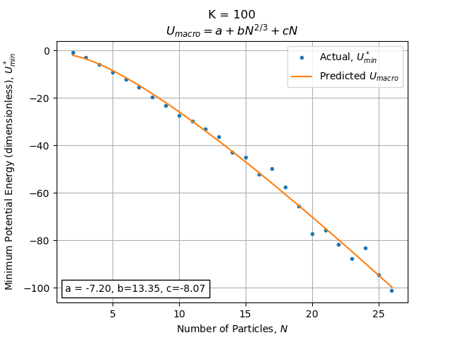
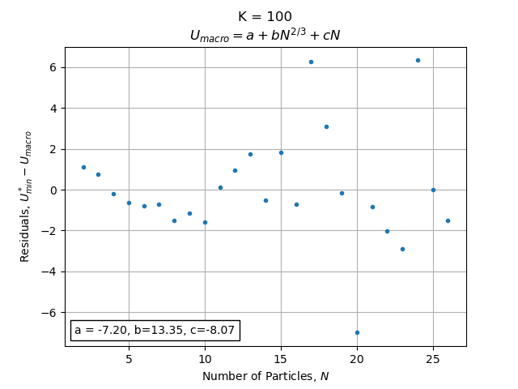

# energy_minimization

Jackson Sheppard\
CH E 210D, Exercise 2\
10/20/22

Here we present an implementation of Conjugate Gradient Descent to find
minimum energy, stable packings of a collection of spherical particles. We
consider the dimensionless Lennard-Jones interaction potential and initialize
random configurations of two to 26 particles, then perform
conjugate gradient descent to find minimum energy configurations. We repeat
this procedure `K` times for each system particle number `N`, with `K` set to
`100`, `1000`, and `10000`, calculating the minimum, average, and maximum
result over the `K` trials. We then plot the minimum and average results of
the `K` searches versus `N`, and compare to both the numerical results taken
from
[Leary, J. Global Optimization 11, 35 (1997)](https://link.springer.com/article/10.1023/A:1026500301312)
and a predicted model for the global energy minimum as a function of `N` based
on macroscopic properties surface area and volume. We then look for dips in
the residual plot for this model, indicating a lower stable energy minimum
than expected from macroscopic scaling and thus a stable packing configuration.

## Installation and Usage
Note the following instructions have been tested using Linux Ubuntu 20.04.5
only. Compiling Fortran on other operating systems may bring additional
challenges.

Clone [this repository](https://github.com/jsheppard95/energy_minimization)
and navigate to its root. Install dependencies defined in the
`environment.yml` file using `conda`:

```
$ conda env create --name envname --file=environment.yml
```

Compile Fortran code `ex2lib.f90` as a Python module as follows:

```
$ f2py -c -m ex2lib ex2lib.f90
```

This generates the
["Shared Object" library file](https://superuser.com/questions/71404/what-is-an-so-file)
`ex2lib.cpython-39-x86_64-linux-gnu.so`. With this file in the working
directory, one can then `import` functions defined in `ex2lib.f90` as Python
functions, noting the letter case is lowered when used in Python. For example,
the Fortran function `CalcForces` is available in Python as

```
import ex2lib
ex2lib.calcforces(*args)
```

making the force and energy calculations far more efficient than if
implemented directly in Python due to the fact that Fortran is a compiled
language.

Generate energy minimization data with the following minimization script. Note
this process can take on the order of days. `K`-specific files (see below) are
however written sequentially, allowing for analysis in parallel.

```
$ python exercise2.py
```

This will write three files to the output directory `data/`:

```
K100_energy_min.txt
K1000_energy_min.txt
K10000_energy_min.txt
```

Each with the following format:

```
N: {}, Minimum P.E: {}, Average P.E: {}, Maximum P.E: {}
```

where `N` ranges from `2` to `26` (inclusive), and the minimum, average, and
maximum are over the `K` conjugate gradient searches for that `N`.

Generate plots and the global energy minimum model with the following analysis
script:

```
$ python analysis.py
```

This script reads the minimization data contained in `data/` (along with the
results obtained by Leary and defined in `data/LearyData.csv`), plots the
results, and writes figures to the output directory `plots/`.

## Results
At this point, the `K = 1000` and `K = 10000` results are yet to complete, but the
code in this repository has been functionalized to make the additional
analysis of these results simple to implement, requiring only additional
function calls pointing to new input files (see below).

### K = 100 Results
Considering `K = 100`, we find reasonable agreement between the minimum
conjugate gradient result over `K` iterations and Leary's minimum potential
energies, but our average is much larger. This highlights the need for a
stochastic element of this minimization routine to obtain an adequate search
over the Potential Energy Surface, since some initial random configurations
are likely to result in a local minimum.



We note a global energy minimum here for `N = 26` particles, obtaining a
dimensionless potential energy of `-101.3`.

Next, we fit a model formulated from macroscopic scaling arguments to the
minimum potential energies found from our conjugate gradient search using the
least squares minimization fitting routing `scipy.optimize.curve_fit`. This
results in the best parameters and curve below:



We then consider the difference between the true minimum obtained by conjugate
gradient search and the model-predicted minimum, `U_min - U_macro`, and look for
dips in the resulting curve, indicating a larger predicted minimum. This would
indicate a stable packing configuration and thus a lower energy configuration
than would be obtained by simple scaling laws. This result is shown below:



From these differences, we note that only `N = 20` has significantly increased
stability, while `N = 13` and `N = 19` are expected. This along with the our
significantly higher average potential energies than minimum potential
energies over our conjugate gradient searches indicates we are unlikely to
have found the global minima using `100` random initial configurations. This
highlights the need for increased search iterations (i.e using `K = 1000`,
`K = 10000`) to adequately sample initial positions on the Potential Energy
Surface and increase the chance of finding a global energy minima as opposed
to a local energy minima.

## Future Work
This repository has been developed for simple extension to the `K = 1000` and
`K = 10000` results upon completion, with functions defined so that the
`__main__` body of `analysis.py` simply needs the addition:

```
# Set file paths
K1000_fname = "K1000_energy_min.txt"
K1000_file = os.path.join("data", K1000_fname)
# Plot K1000 results
PlotResults(K1000_file, 1000)
FitUMacro(K1000_file, 1000)
```

with similar updates for the `K = 10000` case. However, it is clear that
efficiency considerations are needed for a faster analysis. As a first step,
it would be instructive to include `time.time()` calls around each function
in `exercise2.py` (including Fortran functions) to determine any bottlenecks.
One likely slow down is within the function `ConjugateGradient` prior to the
`while` loop:

```
forces_i_1 = ex2lib.calcforces(Pos)
dir_i_1 = np.copy(forces_i_1)
_, PosMin_i_1 = LineSearch(Pos, forces_i_1, dx, EFracTolLS)
EFracCG = 10
while EFracCG > EFracTolCG:
    # Conjugate Gradient Search
```

The calculation of `forces_i_1`, the previous step's forces, is not needed
here. We can instead simply initialize `dir_i_1 = ex2lib.calcforces(Pos)`,
perform the initial line search in this direction, and then begin the `while`
loop for conjugate gradient. This may not however have a significant effect on
run time given this calculation only occurs once per conjugate gradient
search. Further, we are currently using `print()` statements to view progress
which can cause slow downs. We could thus find minor speed improvement by
instead writing progress statements to a `*.log` file that could be checked as
needed.
